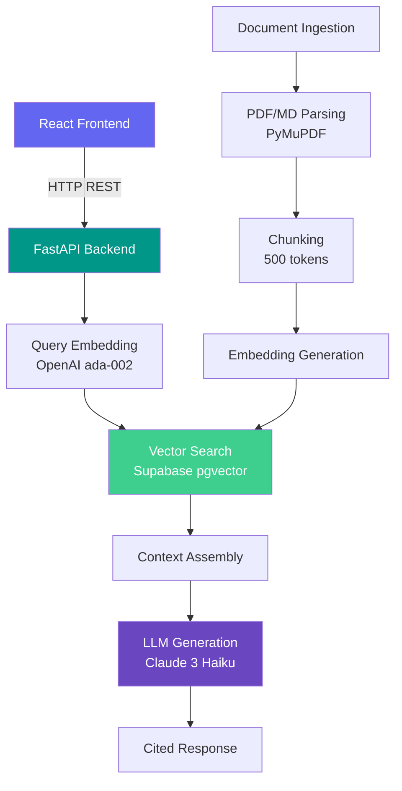

# CryptoGuide AI

<div align="center">

**AI-powered DeFi research assistant** — Ask questions about Aave, Compound, and Uniswap with cited answers from protocol documentation.

[](https://fastapi.tiangolo.com)
[](https://react.dev)
[](https://anthropic.com)
[](https://supabase.com)

</div>

---

## What It Does

CryptoGuide AI uses **Retrieval-Augmented Generation (RAG)** to answer questions about DeFi protocols with cited sources. Instead of reading 45-page whitepapers, ask a question and get an answer in ~3 seconds with inline citations.

### Key Features

- 🔍 **Single Protocol Q&A** — Ask about Aave, Compound, or Uniswap individually
- ⚡ **Protocol Comparison** — Side-by-side analysis of any two protocols
- 📎 **Source Citations** — Every answer includes expandable source cards with page numbers
- 🎯 **100% Retrieval Accuracy** — Verified across 20-question evaluation suite

---

## Architecture



---

## Evaluation Results

| Metric | Result | Target |
|---|---|---|
| **Retrieval Accuracy** | 100% | ≥85% |
| **Keyword Coverage** | 89% | ≥75% |
| **Citation Accuracy** | 100% | ≥90% |
| **Avg Latency** | 3.1s | <15s |
| **Cost/Query** | $0.0009 | <$0.05 |

*Evaluated on 20 curated test cases across Aave (8), Compound (6), and Uniswap (6).*

---

## Tech Stack

| Layer | Technology |
|---|---|
| **Frontend** | React 18, Vite, TailwindCSS |
| **Backend** | FastAPI (Python 3.11+) |
| **LLM** | Claude 3 Haiku (Anthropic) |
| **Embeddings** | text-embedding-ada-002 (OpenAI) |
| **Vector DB** | Supabase (PostgreSQL + pgvector) |
| **Orchestration** | LangChain |

---

## Quick Start

### Prerequisites
- Python 3.11+
- Node.js 18+
- Supabase account (free tier works)
- API keys: Anthropic + OpenAI

### Setup

```bash
# Clone
git clone https://github.com/yourusername/cryptoguide-ai.git
cd cryptoguide-ai

# Backend
cd backend
python -m venv venv && source venv/bin/activate
pip install -r requirements.txt
cp .env.example .env  # Add your API keys

# Frontend
cd ../frontend
npm install
```

### Environment Variables

Create `backend/.env`:
```env
OPENAI_API_KEY=sk-...
ANTHROPIC_API_KEY=sk-ant-...
SUPABASE_URL=https://your-project.supabase.co
SUPABASE_KEY=your-anon-key
```

### Run

```bash
# Terminal 1: Backend
cd backend && uvicorn main:app --host 0.0.0.0 --port 8000

# Terminal 2: Frontend
cd frontend && npm run dev
```

Open http://localhost:5173

---

## API Endpoints

| Method | Endpoint | Description |
|---|---|---|
| `POST` | `/api/query` | Single protocol Q&A |
| `POST` | `/api/compare` | Multi-protocol comparison |
| `GET` | `/health` | Health check |

### Example Request

```bash
curl -X POST http://localhost:8000/api/query \
  -H "Content-Type: application/json" \
  -d '{"question": "How does liquidation work?", "protocol": "aave"}'
```

---

## Project Structure

```
cryptoguide-ai/
├── backend/
│   ├── main.py              # FastAPI app + endpoints
│   ├── rag.py               # RAG pipeline (retrieve → generate)
│   ├── compare.py           # Comparison engine
│   ├── evaluation/
│   │   ├── ground_truth.json    # 20 test cases
│   │   ├── evaluate.py          # Evaluation script
│   │   └── eval_report.md       # Auto-generated metrics
│   └── scripts/
│       └── ingest_documents.py  # Document ingestion CLI
├── frontend/
│   └── src/
│       ├── App.jsx
│       └── components/
│           ├── ChatInterface.jsx
│           ├── MessageBubble.jsx
│           ├── SourceCard.jsx
│           ├── ProtocolSelector.jsx
│           ├── SuggestedQuestions.jsx
│           └── LoadingState.jsx
└── docs/
    ├── cryptoguide_PRD.md
    ├── design_manifesto.md
    └── case_study.md
```

---

## Key Product Decisions

1. **Claude 3 Haiku over Sonnet** — 70% cost reduction ($0.0009 vs $0.015/query) with negligible quality loss for documentation Q&A
2. **Supabase over Pinecone** — Free tier sufficient for MVP; standard SQL allows protocol filtering via `WHERE` clauses
3. **500-token chunks** — Balances context specificity with retrieval breadth; tested against 300 and 700
4. **Protocol column over namespaces** — Enables cross-protocol queries and comparison without duplicate infrastructure

---

## License

MIT
