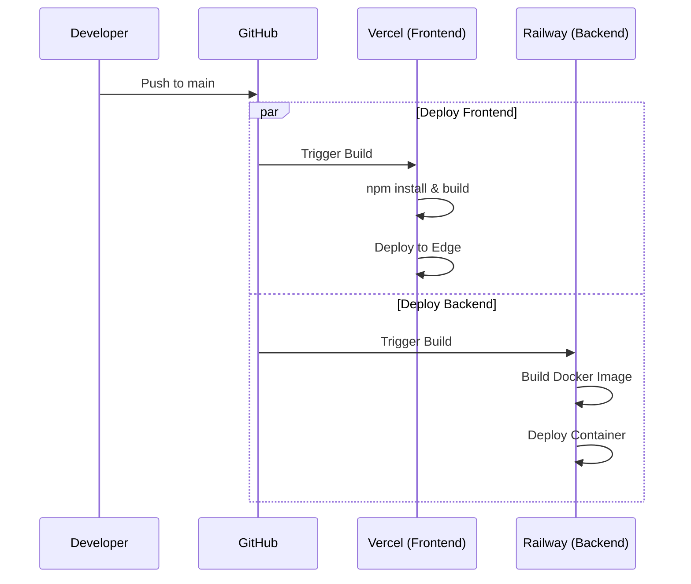

# CryptoGuide AI — Infrastructure & Architecture

This document outlines the system architecture, data flow, and deployment strategy for CryptoGuide AI.

## High-Level Architecture

```mermaid
graph TD
    subgraph Client ["Frontend (Client-Side)"]
        UI[React + Tailwind App]
        Browser[User Browser]
        UI -->|User Query| Browser
    end

    subgraph Service ["Backend Service"]
        API[FastAPI Server]
        RAG[RAG Pipeline]
        Router[Protocol Router]
        Compare[Comparison Engine]
        
        API --> Router
        Router --> RAG
        Router --> Compare
    end

    subgraph Data ["Data & Vector Store"]
        Supabase[(Supabase PostgreSQL)]
        Vector[pgvector Extension]
        
        Supabase --> Vector
    end

    subgraph External ["External AI Services"]
        OpenAI[OpenAI (Embeddings)]
        Claude[Anthropic Claude 3 Haiku (LLM)]
    end

    %% Data Flow
    Browser -->|HTTP POST /api/query| API
    
    %% RAG Flow
    RAG -->|1. Generate Embedding| OpenAI
    OpenAI -.->|Vector| RAG
    
    RAG -->|2. Similarity Search| Vector
    Vector -.->|Context Chunks| RAG
    
    RAG -->|3. Generate Answer| Claude
    Claude -.->|Final Answer| RAG
    
    RAG -->|JSON Response| API
```

## Component Details

### 1. Frontend (Presentation Layer)
- **Framework:** React 18 (Vite)
- **Styling:** TailwindCSS v4 + Custom Design System ("Crystalline")
- **State:** Local React State (`useState`)
- **Hosting:** Vercel (Static Site Generation)

### 2. Backend (Application Layer)
- **Framework:** FastAPI (Python 3.11)
- **Server:** Uvicorn (ASGI)
- **Hosting:** Railway (Dockerized Container)
- **Key Files:**
  - `main.py`: API entry points & CORS
  - `rag.py`: Orchestrates retrieval & generation
  - `compare.py`: Handles multi-protocol comparison logic

### 3. Data Layer (Persistence)
- **Database:** Supabase (Managed PostgreSQL)
- **Extension:** `pgvector` for vector similarity search
- **Schema:**
  - `documents` table: `id`, `content`, `embedding` (1536d), `metadata` (JSONB)
- **Indexing:** IVFFlat index for performance

### 4. AI Services (Intelligence)
- **Embeddings:** OpenAI `text-embedding-ada-002` (Cost-effective, standard)
- **LLM:** Anthropic Claude 3 Haiku
  - Selected for speed (~3s latency) and cost ($0.25/M tokens)
  - 200k context window allows large RAG context injection

---

## Deployment Pipeline (CI/CD)


